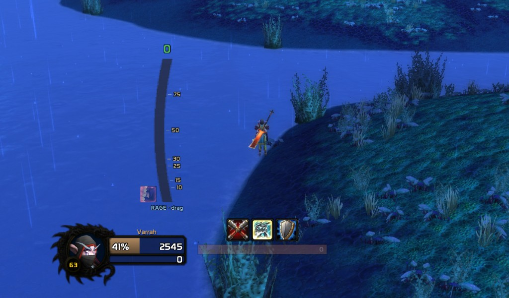

# RageForge

A smart rage display for stance-dancing TBC warriors on the WoW Classic
Anniversary realms. Built for PvP-first decision making.

The default rage bar tells you a number. RageForge tells you the *cost* of
your next stance dance, at a glance.

## Screenshots



*Idle bar (0 rage), unlocked. Threshold ticks at 10 / 15 / 25 / 30 / 50 / 75
sit outside the bar to the right. The Battle Shout icon at the bottom-left
appears whenever the buff is missing. More screenshots — combat, settings
window, stance rail close-up — coming.*

## Creator

RageForge is built by **Chase Sommer**, a game designer who loves to play and
build addons and communities around WoW.

- X: https://x.com/SommerChase
- YouTube: https://www.youtube.com/@chasesommer
- Patreon: https://www.patreon.com/cw/chasesommer

## Why

If you've ever stood in front of a healer thinking "do I have enough rage to
dump and stance-dance into Overpower right now, or will I bleed out?" — this
addon answers that question without you doing math.

## Features (v0.9.7)

- **Smoother no-art curved bar** rendered as 1-pixel horizontal rows with
  full-opacity centers and soft left/right feather strips. Row centers are
  pixel-snapped to reduce sampling shimmer; feathering softens the visible
  staircase that rectangular UI textures naturally create on a curve.
- **Blended brighter rage colors** instead of hard zone bands. The retained
  rage band stays green, then smoothly blends through gold -> molten orange
  -> blood red as stance-dance cost increases.
- **Full-opacity current rage row** — the fill now rounds the animated value
  to the nearest whole rage before painting slices, so the current rage band
  never appears as a half-faded row.
- **Left-side decision hints** — the retained-rage notch, ghost line, and
  `-X` dump hint live on the left side of the bar, keeping the right side
  reserved for threshold tick labels.
- **Stance icon rail** — cropped Battle / Defensive / Berserker stance icons
  sit in a tight stack touching the bar's left edge. Icons are square-cropped
  and rotated so the spell icon's top points left; inactive stances are only
  alpha-dimmed, not color-tinted or desaturated. The active stance uses
  Blizzard's action-button border art as a gold outline.
- **Battle Shout reminder** — a Battle Shout icon appears at the bottom-left
  of the rage bar when the buff is missing or has less than 30 seconds
  remaining, then flashes until refreshed. If the buff is active but expiring,
  a countdown appears over the icon. Suppressed while dead or ghosted.
- **Researched rendering limitation:** Classic can crop/transform textures
  with `SetTexCoord`, and WeakAuras uses custom progress-texture math for
  circular displays, but Classic does not give arbitrary curved masking for
  our vertical bar. A perfect bend will require a custom TGA/BLP skin.
- **No background chrome.** When the bar is locked, nothing exists on
  screen except the bar, ticks, and labels. When unlocked, the "RAGE"
  label shifts to "RAGE \194\183 drag" in light blue as a subtle drag cue.
- **In-game settings window** via `/rf options`. Lock, scale, Tactical
  Mastery rank, display toggles, stance icons, and font size. Live preview -
  changes apply as you click. RageForge still attempts Blizzard AddOns-tab
  registration when the client supports it, but `/rf options` is the reliable
  path.

- **Color-coded stance-dance economy zones**, dynamic to your Tactical
  Mastery rank:
  - **Green (0..retained)** — free dance, you keep everything.
  - **Yellow (retained..50)** — small loss on dance, fine in most cases.
  - **Orange (50..75)** — meaningful loss; consider dumping rage first.
  - **Red (75..100)** — heavy loss; dump rage *before* you dance.
- **Dump hint** — a live `-X` label next to the bar showing exactly how much
  rage you'd lose if you stance-dance right now. Yellow / orange / red by
  severity.
- **Ghost-line marker** — bright notch on the bar's left edge at the rage
  you'd land on after a dance, with a horizontal line extending to the
  dump-hint label. Hides entirely when a dance would lose nothing.
- **Threshold ticks** at 10 / 15 / 25 / 30 / 50 / 75 — the rage costs that
  matter (Overpower, HS, Hamstring, MS / Rend, post-dance floor, cap warn).
  Sit OUTSIDE the bar to the right; never cross the fill.
- **Rage-cap warning** — top of the bar pulses yellow within 5 rage of cap so
  you spot wasted rage in heated fights.
- **Consistent typography** — RageForge bundles `Prototype.ttf` in
  `RageForge/Fonts/` for the bar UI, with `Fonts\SKURRI.TTF` as a fallback.
  The bundled `Prototype.txt` from the font's author is shipped alongside it
  per the readme's redistribution note.
- **Drag-to-move + scale + lock** via slash commands. The bar is invisible
  chrome when locked; the `RAGE` label changes to `RAGE \194\183 drag` when
  unlocked so you know it can be moved.

## Install

### Option A: Copy (simple, recommended for normal use)

```powershell
cd C:\Users\rober\rageforge
.\install.ps1
```

That copies `RageForge\` into:

```
C:\Program Files (x86)\World of Warcraft\_anniversary_\Interface\AddOns\RageForge\
```

### Option B: Junction (recommended while developing / tweaking)

```powershell
.\install.ps1 -Symlink
```

This creates a directory junction so edits in this repo are immediately
visible in WoW. Just `/reload` in game (or relog) to pick up Lua changes.

Junctions don't require admin rights. If the WoW folder is in a non-default
location, pass `-WowPath`:

```powershell
.\install.ps1 -Symlink -WowPath "D:\Games\World of Warcraft\_anniversary_"
```

### Uninstall

```powershell
.\install.ps1 -Uninstall
```

## Release Packaging

For CurseForge or GitHub releases, build a clean addon zip:

```powershell
.\package.ps1
```

That creates `dist\RageForge-v<version>.zip` with the required top-level
`RageForge\` folder. The package script removes local-only personal-use fonts
from the release artifact.

## In-game usage

After installing, log in. You should see the bar to the left of center
screen.

**Easiest way to configure:** type `/rf`. You get a movable
RageForge settings window with checkboxes and sliders. Changes preview live.

For power users / scripts, every setting is also a slash command:

```
/rf options      open the RageForge settings window
/rf              open the RageForge settings window
/rf tm 5         set Tactical Mastery to 5/5 (25 rage retained on dance)
/rf tm 3         set Tactical Mastery to 3/5 (15 rage retained)
/rf tm 0         no Tactical Mastery (0 rage retained)
/rf lock         toggle lock; unlocked = drag to move
/rf scale 1.0    set UI scale (0.5 .. 2.0)
/rf reset        reset position to default
/rf ticks        toggle threshold tick marks
/rf stances      toggle stance icon rail
/rf ghost        toggle the ghost (post-stance-dance) line
```

The most important command is `/rf tm <0|3|5>`. Everything else is cosmetic;
this one controls the math.

## How the math works

Stance change in TBC drops your rage to `min(currentRage, retainedRage)`,
where `retainedRage` is determined by your Tactical Mastery rank
(0 / 15 / 25 for 0/5, 3/5, 5/5 respectively).

So the value of a stance dance is:

```
rage_lost = max(0, currentRage - retainedRage)
```

The ghost line is drawn at `min(currentRage, retainedRage)`. The fill above
that line is, visually, "rage you're about to throw away if you dance now."

## Roadmap

If v1 lands well, here are the modules I'd add next (in priority order for
PvP):

1. **Diminishing Returns tracker** — Hamstring / Concussion Blow / Intercept
   stun DRs per target. Huge in arena.
2. **Enemy PvP trinket / WotF tracker** — know when to land your CC.
3. **Charge / Intercept / Death Wish / Recklessness CD bars** — burst and
   mobility planner.
4. **Heroic Strike queued indicator** — HS is on next-swing in TBC, easy to
   forget you queued it (and lose rage on it).
5. **Hamstring + Rend uptime** — kite/peel maintenance.
6. **MS debuff on target** — make sure your healing reduction is applied.

## What to Add Before a Wider Launch

- **Screenshots/GIFs** for GitHub, CurseForge, and the addon page. A single
  combat screenshot plus one settings-window screenshot will make this much
  easier for players to trust.
- **A short CurseForge description** with the same feature bullets as this
  README, plus a clear note that this targets TBC Anniversary warriors.
- **A small icon/logo** for the addon listing. Long term, a custom warrior-style
  bar texture could also replace the no-art row renderer for a smoother premium
  look.
- **A first feedback pass from real arena/BG use** before calling it 1.0.

## Files

```
rageforge/
+-- README.md            this file
+-- install.ps1          copy / junction the addon into WoW AddOns
+-- package.ps1          build clean CurseForge/GitHub release zip
+-- CHANGELOG.md         release notes
+-- LICENSE              MIT license
+-- RageForge/
|   +-- RageForge.toc    addon manifest (Interface 20505 = TBC Anniversary)
|   +-- Config.lua       SavedVariables, defaults, /rf slash command
|   +-- Core.lua         init, event router, OnUpdate driver
|   +-- RageBar.lua      the curved bar, zones, ghost line, ticks, glow
|   +-- Options.lua      standalone /rf settings window
+-- .cursor/rules/       Cursor IDE rules for working on this addon
```

## Compatibility

- **Target client:** WoW Classic Anniversary, TBC content phase
  (Interface 20505, version 2.5.5).
- The addon is class-agnostic in terms of API: it only reads your rage and
  combat log. It will load on any class but is only useful for warriors.
- If a future Anniversary patch bumps the Interface number, WoW will mark the
  addon "out of date." Either tick "Load out of date addons" at the AddOns
  screen or bump the `## Interface:` line in `RageForge.toc`.

## Credits

RageForge bundles the **Prototype** font for its bar UI. Prototype was created
by **Justin Callaghan** and is based on signage from Walt Disney World's Epcot
park.

- Author: Justin Callaghan
- Author site: https://mickeyavenue.com/
- Font listing: https://fontmeme.com/fonts/justin-callaghan-listing/

The font ships alongside its original `Prototype.txt` readme inside
`RageForge/Fonts/` as the author asks. All credit for the typeface goes to
Justin Callaghan; RageForge only redistributes it.

## License

MIT. See `LICENSE`.

RageForge code is MIT-licensed. The bundled `Prototype.ttf` is the property of
Justin Callaghan and is not covered by RageForge's MIT license — see the
**Credits** section above and the bundled `RageForge/Fonts/Prototype.txt` for
the font's own terms. If the font author requests removal or you want a 100%
permissively-licensed alternative, the addon already falls back cleanly to
`Fonts\SKURRI.TTF` (shipped with WoW) with no code changes.
